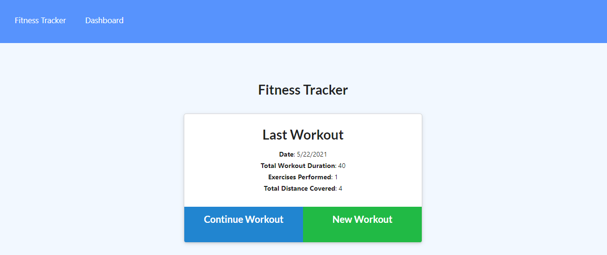
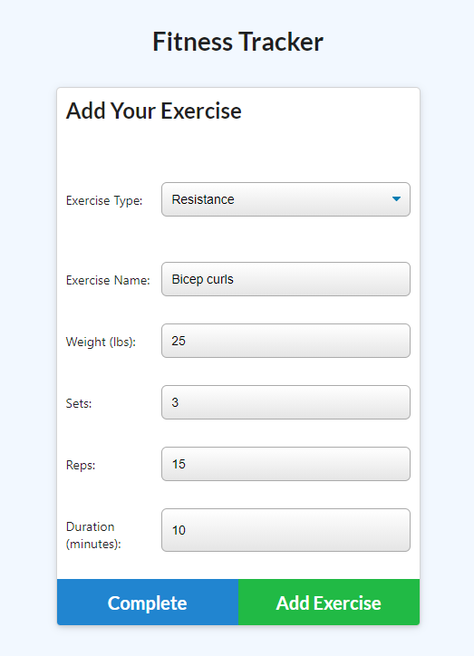
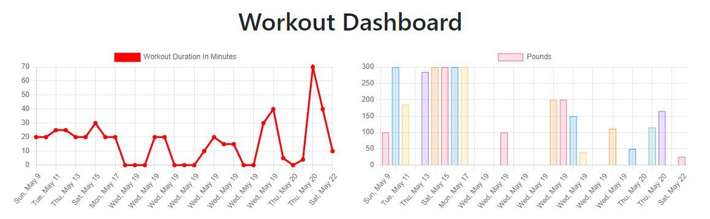

# NoSQL-Workout-Tracker

Workout tracker using MongoDB, Mongoose, Node.JS, and Heroku

---

## Description

Use the fitness tracker to meet your fitness goals. Add resistance or cardio exercises completed, update exercise sessions, and view a summary of the last seven workouts.
\
\

---

## Installation

In order to use the Fitness Tracker application, you will need to follow the following steps:

1. Use Command Prompt or the VS terminal to install the needed npm node packags:
   - Run 'npm install' to pull down the npm package manager.
   - Make sure you have MongoDB and Mongoose installed
2. In Git Bash or VS terminal, run node seeds/index.js to create the tables and insert data.
3. Run 'npm start' in either the command prompt or VS terminal.
4. Navigate to the localhost to view and test application.

---

## Usage

This program can be used with permission.\
Go to the Heroku deployment:

---

## License

---

## Contact

If you have any questions, please contact me at:\
✉️[Email](mailto:hrkoren@gmail.com)\
📂[GitHub](https://github.com/hrkoren)
